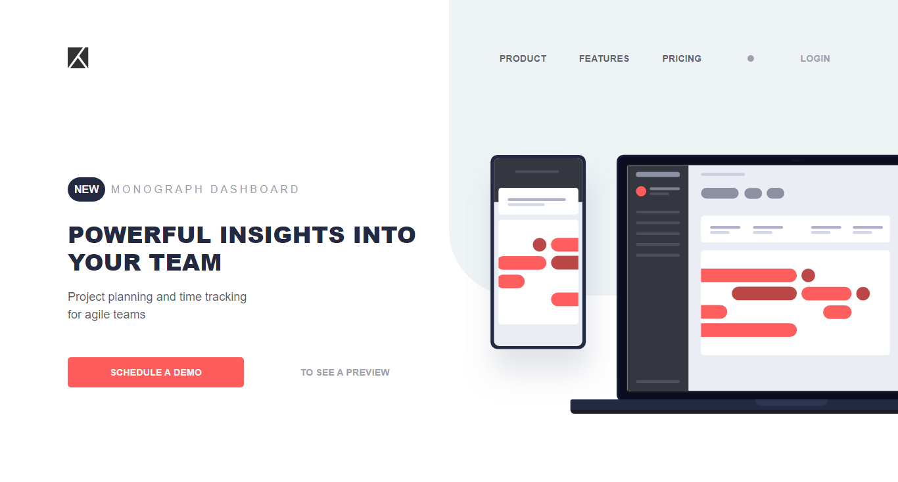
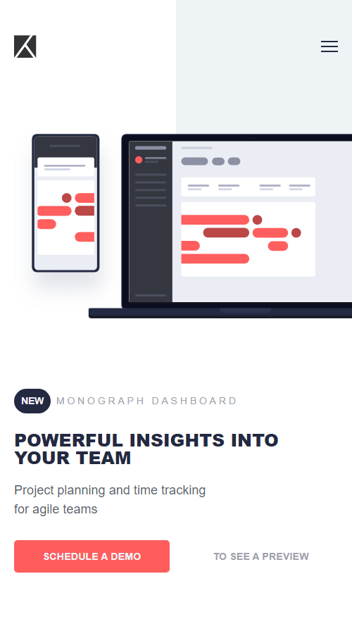

# Frontend Mentor - Project tracking intro component solution

This is a solution to the [Project tracking intro component challenge on Frontend Mentor](https://www.frontendmentor.io/challenges/project-tracking-intro-component-5d289097500fcb331a67d80e). Frontend Mentor challenges help you improve your coding skills by building realistic projects.

## Table of contents

- [Overview](#overview)
  - [The challenge](#the-challenge)
  - [Screenshot](#screenshot)
  - [Links](#links)
- [My process](#my-process)
  - [Built with](#built-with)
  - [What I learned](#what-i-learned)
- [Author](#author)

## Overview

### The challenge

Users should be able to:

- View the optimal layout for the site depending on their device's screen size
- See hover states for all interactive elements on the page
- Create the background shape using code

### Screenshot

Desktop View



Mobile View



I added a new feature outside the original design


### Links

- Solution URL: [GitHub Repo](https://github.com/GentryHQ/Project-tracking-intro-component)
- Live Site URL: [GitHub Page](https://gentryhq.github.io/Project-tracking-intro-component/)

## My process

### Built with

- Semantic HTML5 markup
- CSS custom properties
- Flexbox
- Mobile-first workflow
- SCSS/SASS

### What I learned

- I was able to add a blur background when the menu is opened

see code snippets below:

```css
.hero.active::before {
  content: "";
  position: absolute;
  height: 100vh;
  width: 100vh;
  top: 0;
  right: 0;
  left: 0;
  bottom: 0;
  background-color: rgba(255, 255, 255, 0);
  backdrop-filter: blur(10px);
  z-index: 1;
}
```

## Author

- Website - [gentry.com.ng](https://www.gentry.com.ng)
- Frontend Mentor - [@GentryHQ](https://www.frontendmentor.io/profile/GentryHQ)
- Twitter - [@iam_gentry](https://www.twitter.com/iam_gentry)
